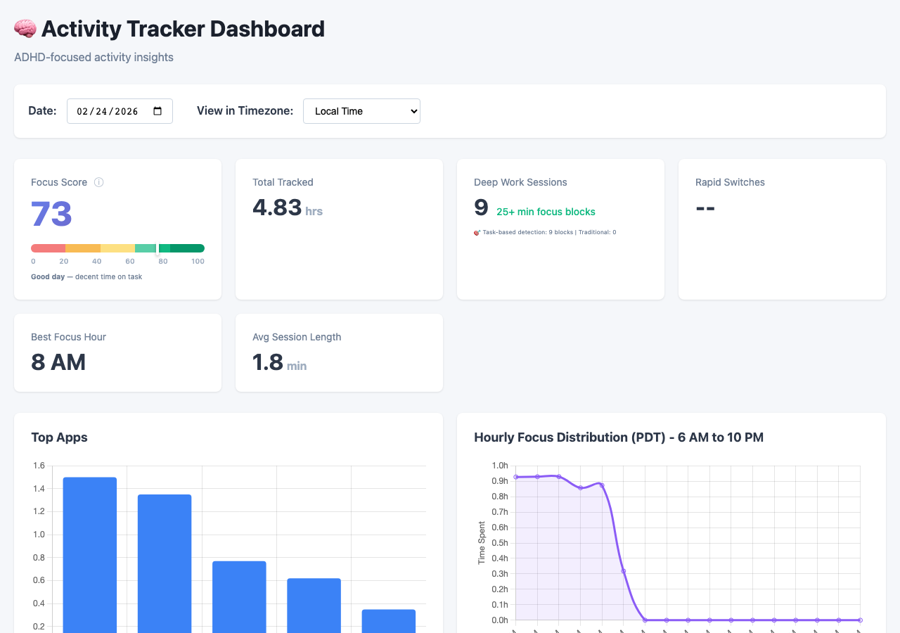
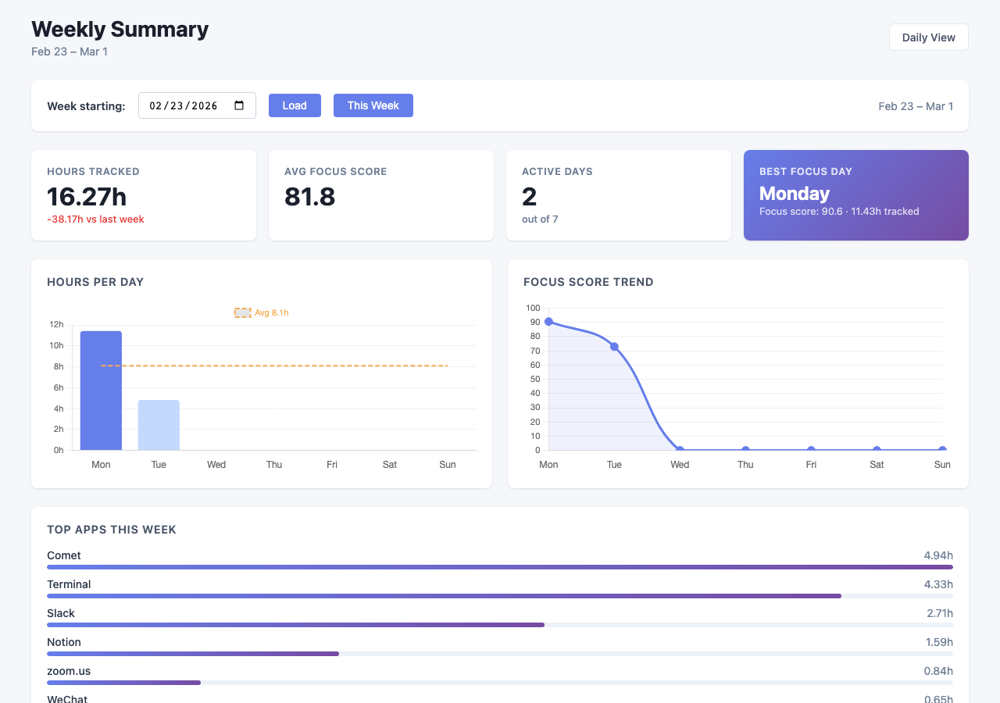

# macOS Activity Tracker

You end a work day feeling busy, but you have no idea where the time actually went. Was that a focused day or a scattered one? How many hours did you really work vs. how many did you spend ping-ponging between apps?

Most time trackers require manual input — you have to remember to start a timer, tag a project, log an entry. This one runs in the background and just watches what you do. No input required.

It tracks every app switch, calculates a focus score based on your actual switching patterns, and gives you a dashboard that shows daily and weekly trends. The data lives on your Mac. Nothing leaves your machine.

Built for people with ADHD (or anyone who loses track of their own attention) who want honest visibility into their work life.




---

## What It Does

- **Tracks every app switch** using the macOS Accessibility API (polls every 5s)
- **Calculates a Focus Score** (0–100) based on hours tracked, rapid context switches, and switching rhythm
- **Surfaces your best focus hours** and average session length
- **Weekly trends view** — hours per day, focus score over the week, top apps
- **Daily Journal** — rich text editor (Quill-powered) that auto-saves per day, so you can add context to your metrics
- **Privacy-first** — all data stays on your machine, sensitive apps are auto-detected and anonymized
- **Optional AI categorization** using Claude API — ~$0.12/month via Batch API + prompt caching

---

## Focus Score Formula

The score is designed to reward sustained work, not penalize productive multi-tasking:

| Component | Weight | What It Measures |
|-----------|--------|-----------------|
| Hours tracked | 50pts | Time on the computer (scales to 8h = 50pts) |
| Rapid switch ratio | 30pts | Switches under 30s as a fraction of total sessions |
| Switches per hour | 20pts | Context switching rhythm (penalizes > 60/hr) |

A full focused day scores ~89–91. A lighter day scores ~65–75. An off day scores ~50.

---

## System Requirements

- **macOS 10.14+** (macOS Accessibility API required — Linux/Windows not supported)
- **Python 3.8+**
- Accessibility permissions granted to Terminal or Python

---

## Quick Start

### 1. Clone and set up

```bash
git clone <repo-url>
cd macos-activity-tracker
./scripts/setup.sh
```

This creates the virtual environment, installs dependencies, and copies `.env.example` → `.env`.

### 2. Add your Anthropic API key (optional)

AI categorization is optional. If you want it, edit `.env`:

```
ANTHROPIC_API_KEY=your_key_here
```

Get a key at https://console.anthropic.com/ — the tracker uses Batch API so costs are minimal.

### 3. Grant Accessibility permissions

1. Open **System Settings → Privacy & Security → Accessibility**
2. Click **+** and add **Terminal** (or Python)

### 4. Start tracking

```bash
source venv/bin/activate
python3 services/background_runner.py
```

### 5. Open the dashboard

In a separate terminal:

```bash
source venv/bin/activate
python3 dashboard/app.py
```

Then go to **http://127.0.0.1:5000**

---

## Auto-start at Login (Optional)

Install both services as macOS LaunchAgents so they run automatically:

```bash
# Background tracker (window monitor + activity processor + AI categorizer)
./scripts/install_launchd.sh

# Dashboard web server
./scripts/install_dashboard.sh
```

Management:
```bash
# Dashboard
launchctl start com.adhd-dashboard
launchctl stop com.adhd-dashboard

# Tracker
launchctl start com.activitytracker.monitor
launchctl stop com.activitytracker.monitor
```

---

## Dashboard Pages

### Daily View (`/`)
- Focus Score with explanation (hours, switch ratio, rhythm)
- Hours tracked, active sessions, rapid switch count
- Best focus hour of the day
- Average session length
- Top apps bar chart
- Hourly focus distribution heatmap
- Daily Journal — formatted notes auto-saved per day
- Recent Sessions (collapsible)

### Weekly View (`/weekly`)
- Total hours + delta vs. prior week
- Average focus score for the week
- Active days (days with 2+ hours tracked)
- Best focus day highlight
- Hours per day bar chart with weekly average line
- Focus score trend line
- Top apps for the full week

---

## Architecture

```
macOS Accessibility API
        ↓
  Window Monitor          ← polls every 5s
        ↓
  Activity Processor      ← aggregates into sessions (every 5min)
        ↓
  SQLite Database         ← local, private
        ↓
  AI Categorizer          ← optional Claude API (every 15min)
        ↓
  Flask Dashboard         ← http://127.0.0.1:5000
```

### Key Files

```
tracker/window_monitor.py       # macOS Accessibility API polling
tracker/activity_processor.py  # Raw activities → sessions
ai/categorizer.py               # Optional Claude API categorization
dashboard/app.py                # Flask API + routes
dashboard/templates/index.html  # Daily dashboard
dashboard/templates/weekly.html # Weekly dashboard
database/models.py              # SQLAlchemy models
config/settings.py              # All config from .env
services/background_runner.py  # Runs all three background services
```

---

## Configuration

All settings live in `.env` (copy from `.env.example`):

```bash
# Required for AI categorization (optional feature)
ANTHROPIC_API_KEY=your_key_here

# Tracking behavior
POLLING_INTERVAL_SECONDS=5
SESSION_TIMEOUT_SECONDS=30
RAPID_SWITCH_THRESHOLD_SECONDS=30

# Dashboard
FLASK_HOST=127.0.0.1
FLASK_PORT=5000
```

---

## Privacy

The tracker is intentionally privacy-first:

- All data is stored locally in SQLite (`data/activities.db`) — never sent anywhere
- Sensitive apps (password managers, banking, Keychain) are auto-detected and anonymized
- Window titles from sensitive apps are stored as SHA256 hashes, not plain text
- The `data/` directory is excluded from git

---

## API Endpoints

```
GET /                                          # Daily dashboard
GET /weekly                                    # Weekly dashboard

GET /api/overview?date=YYYY-MM-DD              # Daily summary stats
GET /api/focus/analysis?date=YYYY-MM-DD        # Focus score + ADHD metrics
GET /api/top-apps?date=YYYY-MM-DD&limit=5      # Top apps by time
GET /api/switches?rapid_only=true              # App switch log
GET /api/sessions?date=YYYY-MM-DD              # Session detail
GET /api/weekly?week_start=YYYY-MM-DD          # Weekly summary
GET /api/journal?date=YYYY-MM-DD               # Fetch journal entry for a date
POST /api/journal                              # Save journal entry for a date
```

---

## Troubleshooting

**No data in dashboard**
1. Check if tracker is running: `launchctl list | grep activitytracker`
2. Verify permissions: `python3 scripts/test_permissions.py`
3. Check logs: `tail -f data/logs/tracker.log`

**"Module not found" errors**
```bash
source venv/bin/activate
pip install -r requirements.txt
```

**atomacos not found**
```bash
source venv/bin/activate
pip install atomacos
```

**Port 5000 already in use**
```bash
lsof -i :5000    # Find what's using it
# Then update FLASK_PORT=5001 in .env
```

---

## Stack

- [Python 3](https://www.python.org/) + [Flask](https://flask.palletsprojects.com/) — backend
- [SQLAlchemy](https://www.sqlalchemy.org/) + SQLite — local database
- [atomacos](https://github.com/pyatom/pyatom) — macOS Accessibility API
- [Chart.js](https://www.chartjs.org/) — dashboard visualizations
- [Quill](https://quilljs.com/) — rich text editor for daily journal
- [Claude API](https://www.anthropic.com/) — optional AI categorization (Batch API + prompt caching)

---

## License

MIT
